<div align="center">


<a href="https://github.com/khushidobariya140">
  
</a>

</div>


## 👩‍💻 About Me

```python
class Khushi:
    def __init__(self):
        self.name = "Khushi Dobariya"
        self.role = "Data Analyst → Data Science Learner"
        self.status = {
            "Data Analysis": "✅ Completed",
            "Data Science": "📖 Currently Learning"
        }
        self.tools = ["Python", "SQL", "Excel", "Power BI", "Pandas", "NumPy"]
        self.currently_exploring = ["Machine Learning", "Statistics", "Deep Learning Basics"]
        self.goal = "Become a skilled Data Scientist who turns data into decisions"

    def say_hi(self):
        print("Thanks for visiting my profile! Let's talk data 📊")

me = Khushi()
me.say_hi()
```

- 🎓 Background in **Data Analysis** — cleaning, exploring, and visualizing data to find real insights
- 🔭 Currently leveling up into **Data Science** — statistics, machine learning, and predictive modeling
- 🌱 Learning new algorithms and building projects to apply data science concepts practically
- 💬 Ask me about data cleaning, EDA, dashboards, SQL queries, or Python for data
- ⚡ Fun fact: I love finding the story hidden inside messy datasets

<br>

## 🧭 My Journey

```mermaid
graph LR
    A[📊 Started with Data Analysis] --> B[🧹 Data Cleaning & EDA]
    B --> C[📈 Visualization & Dashboards]
    C --> D[✅ Data Analysis Completed]
    D --> E[🤖 Now Learning Data Science]
    E --> F[🧠 Machine Learning]
    F --> G[🚀 Future Data Scientist]

    style A fill:#6D28D9,stroke:#333,color:#fff
    style B fill:#7C3AED,stroke:#333,color:#fff
    style C fill:#8B5CF6,stroke:#333,color:#fff
    style D fill:#06B6D4,stroke:#333,color:#fff
    style E fill:#0891B2,stroke:#333,color:#fff
    style F fill:#0E7490,stroke:#333,color:#fff
    style G fill:#155E75,stroke:#333,color:#fff
```

<div align="center">



</div>

<br>

## 🛠️ Tech Stack & Tools

<div align="center">

### Languages & Core


### Data Analysis Toolkit


### Data Science (Currently Learning)


### Tools & Platforms


</div>

<br>

## 📊 GitHub Stats

<div align="center">


</div>

<br>

## 🐍 Contribution Snake

<div align="center">

</div>

> ℹ️ To activate the snake animation above, add the **GitHub Actions workflow** below to this repo (instructions at the bottom of this README).

<br>

## 🎯 Currently Focused On

<div align="center">

| 📚 Learning | 🛠️ Building | 🎯 Next Goal |
|:---:|:---:|:---:|
| Machine Learning Fundamentals | Data Science Mini-Projects | Predictive Modeling Project |
| Statistics for Data Science | EDA + Visualization Projects | Portfolio-Ready Case Studies |
| Python for ML (Scikit-learn) | Kaggle Practice Notebooks | Real-World Data Science Role |

</div>

<br>

## 📈 Skill Progress

<div align="center">

**Data Analysis**


**Data Science**


</div>

<br>

## 🤝 Let's Connect

<div align="center">

<a href="https://github.com/khushidobariya140">
  
</a>
<a href="mailto:youremail@example.com">
  
</a>
<a href="https://www.linkedin.com/">
  
</a>

</div>

<br>

<div align="center">

### 💭 "Data will talk to you if you're willing to listen."


</div>


