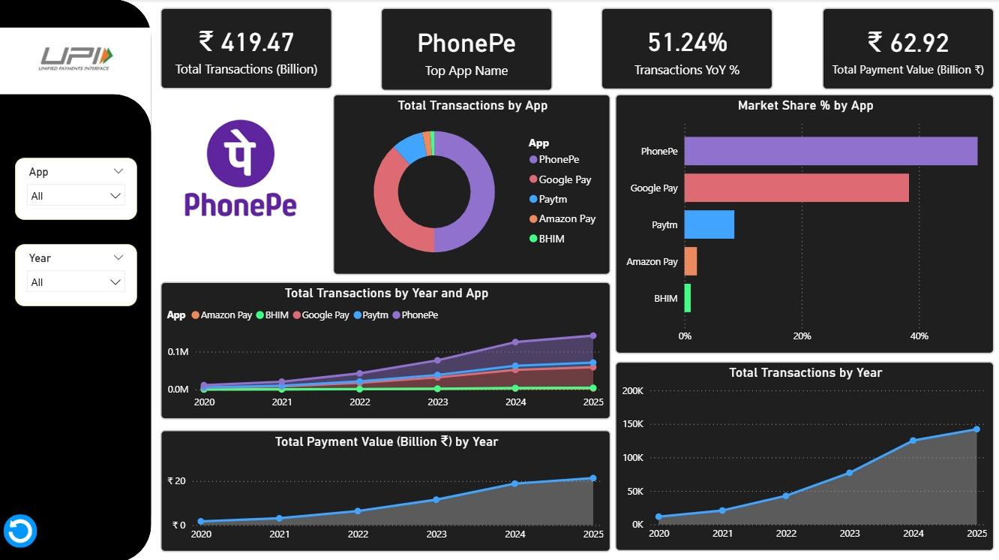
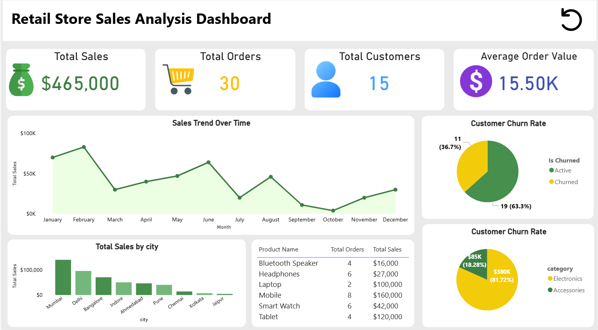
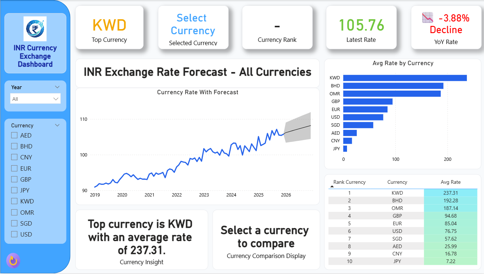
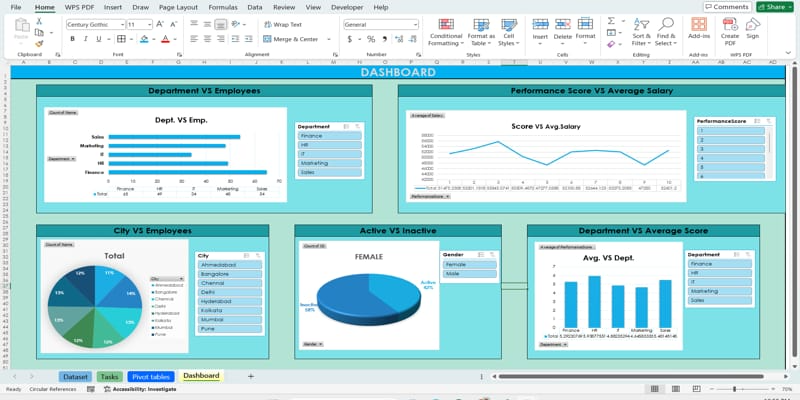
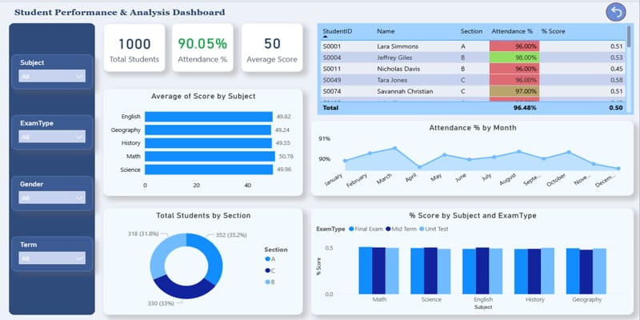

 

  

  

Hey, I'm Khushi 👋 I like taking messy spreadsheets and turning them into dashboards that actually tell a story. Below are a few of my favorites — built in Power BI and Excel, powered by way too much coffee ☕

<h2 align="center">🧠 Skills</h2>

 

<h1 align="center">📊 Project Showcase</h1>

 

<!-- PROJECT 1 : image left -->
<table>
<tr>
<td width="55%" valign="middle">

</td>
<td width="45%" valign="middle">

### 💳 UPI Transactions Dashboard

Analysis of UPI transaction trends across PhonePe, Google Pay, Paytm, Amazon Pay, and BHIM — tracking total transactions, market share, and payment value growth from 2020 to 2025.

**Highlights**
- Total transactions & payment value KPIs
- Market share % by app
- Year-over-year growth trend
- Interactive App & Year filters

</td>
</tr>
</table>

<!-- PROJECT 2 : image right -->
<table>
<tr>
<td width="45%" valign="middle">

### 🛍️ Retail Store Sales Analysis Dashboard

End-to-end retail performance dashboard tracking revenue, orders, customers, churn, and top-selling products across multiple cities.

**Highlights**
- Sales trend over time
- City-wise sales comparison
- Customer churn rate analysis
- Product-level order & sales breakdown

</td>
<td width="55%" valign="middle">

</td>
</tr>
</table>

<!-- PROJECT 3 : image left -->
<table>
<tr>
<td width="55%" valign="middle">

</td>
<td width="45%" valign="middle">

### 💱 INR Currency Exchange Dashboard

Forecasting and comparison dashboard for INR exchange rates against major world currencies, with historical trend lines and average rate rankings.

**Highlights**
- Rate forecasting with trendline
- Currency-wise average rate ranking
- YoY rate change indicator
- Multi-currency filter selection

</td>
</tr>
</table>

<!-- PROJECT 4 : image right -->
<table>
<tr>
<td width="45%" valign="middle">

### 🏢 Employee Performance Dashboard

Department-wise employee analysis covering headcount, performance scores, salaries, and demographics — built using pivot tables and dynamic charts.

**Highlights**
- Department vs employee count
- Performance score vs average salary
- City-wise employee distribution
- Active vs inactive status breakdown

</td>
<td width="55%" valign="middle">

</td>
</tr>
</table>

<!-- PROJECT 5 : image left -->
<table>
<tr>
<td width="55%" valign="middle">

</td>
<td width="45%" valign="middle">

### 🎓 Student Performance & Analysis Dashboard

Academic performance tracking dashboard analyzing scores, attendance, and section-wise trends across subjects and exam types for 1,000+ students.

**Highlights**
- Average score by subject
- Attendance % trend by month
- Section-wise student distribution
- Score breakdown by exam type

</td>
</tr>
</table>

 

## 📈 GitHub Stats

<table>
<tr>
<td width="50%" align="center">

</td>
<td width="50%" align="center">

</td>
</tr>
</table>

 

 

## 💬 Let's Talk Data

Got a dataset that needs a story, a dashboard idea, or just want to talk analytics? I'd love to connect.

  

<i>Thanks for stopping by my profile — hope one of these dashboards inspired an idea for your own data! 🌱</i>

